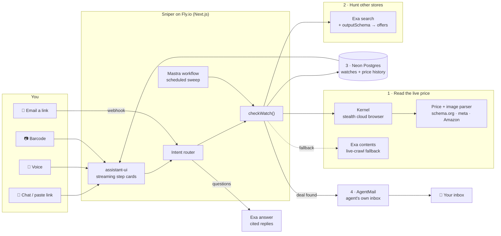

# 🎯 Price-Drop Sniper

**Your personal deal-hunting agent.** Paste a product link, say what you want, scan a barcode, or email it a link — it hunts every store for the best price and emails you the moment it drops.

Built at the [Build Personal Agents Hack](https://build-personal-agents.com) (SF, Oct 2026).

**▶ [Watch the 1-minute demo](demo/sniper-demo.mp4)**

## What it does

- **Paste a link** → reads the live price on that page, finds the same product at other retailers, saves the price history, and alerts you if anything beats your target.
- **Say it** 🎤 → "snipe Sony XM5 headphones under 300" (browser speech recognition, no API key).
- **Scan it** 📷 → point your camera at a barcode; the UPC is resolved to a product and sniped.
- **Email it** 📬 → forward a product link to the agent's own inbox; it replies with the best price and keeps watching.
- **Ask it** 🔎 → "what's the cheapest Switch 2 right now?" gets a grounded answer with citations.
- **Re-checks on a schedule** → a Mastra workflow sweeps every watched product and emails deal alerts.

## Architecture



| Sponsor | Role |
|---|---|
| **Kernel** | Stealth cloud browser loads bot-protected product pages; live view streams into the chat |
| **Exa** | Cross-retailer price search with structured output, barcode → product, live-crawl price fallback, grounded Q&A |
| **Neon** | Postgres for watches and price history |
| **Mastra** | Workflow that sweeps and re-prices every watch |
| **AgentMail** | The agent's own inbox: sends alerts, receives links by email |
| **assistant-ui** | Chat UI with streaming per-step tool cards |
| **Fly.io** | Hosting |

No LLM credits required: prices are parsed deterministically from page markup, and Exa provides the language layer.

## Run it

```bash
npm install
cp .env.example .env.local   # fill in keys
npm run dev
```

`.env.local`:

```
AGENTMAIL_API_KEY=   AGENTMAIL_INBOX=you@agentmail.to
EXA_API_KEY=
KERNEL_API_KEY=      # optional: falls back to fetch + Exa
DATABASE_URL=        # optional: falls back to in-memory store
ALERT_EMAIL=you@example.com
```

Re-record the demo video with `node scripts/record-demo.mjs && node scripts/build-video.mjs` (narration: Microsoft neural voice `en-US-AvaMultilingualNeural` via `edge-tts`, one clip per line of `scripts/narration.txt` saved as `demo/seg<N>.aiff`).

Point an AgentMail webhook (`message.received`) at `/api/inbound` to enable email-in. Hit `/api/sweep` on a schedule to run the Mastra sweep.
